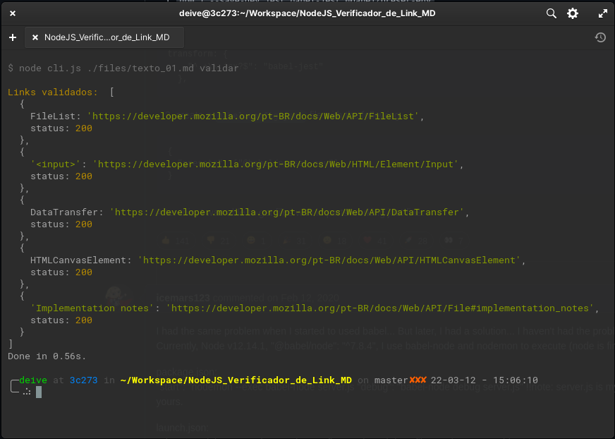

# Markdown Link Validator

Aplicativo para validar se as URL's dentro de um arquivo markdown estão funcionando.

Faz uma requisição para a URL. Se a resposta for com status code 200, o link está validado.

# Os comandos disponíveis são:
- ```yarn start path_to_md_file```
  - Lista as URL's disponíveis dentro do arquivo passado
- ```yarn start path_to_md_file validar```
  - Lista e valida as URL's disponíveis dentro do arquivo passado

